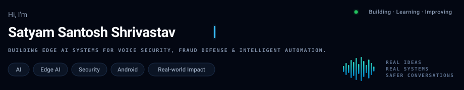
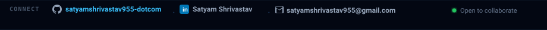
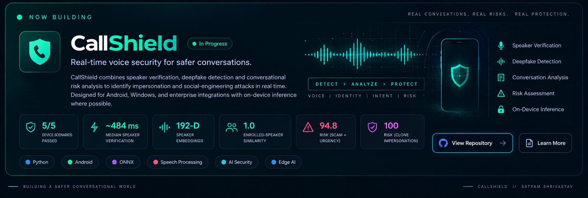
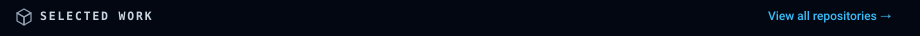
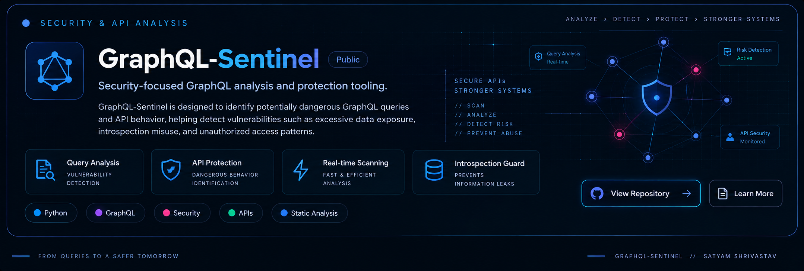
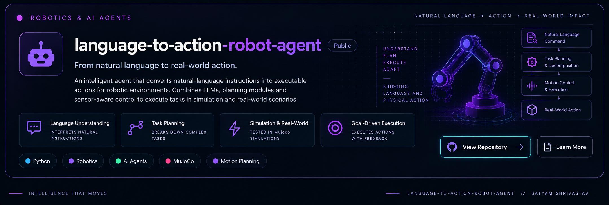
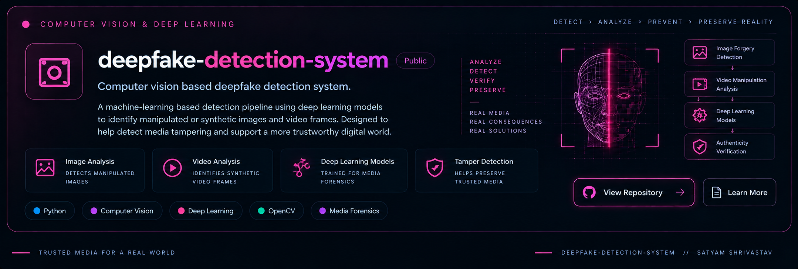
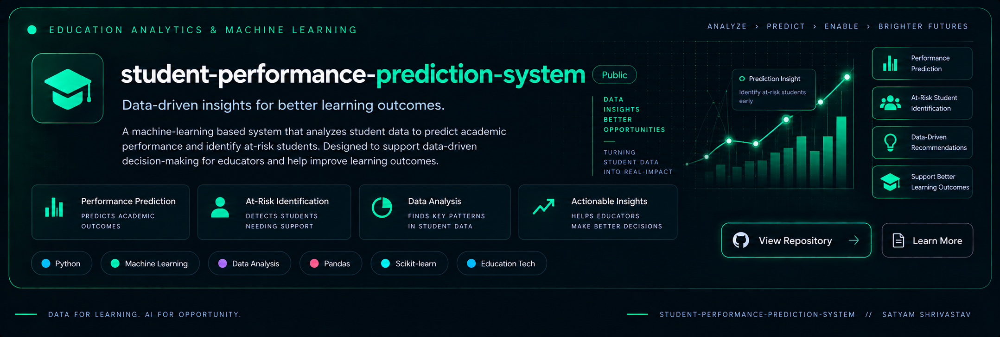
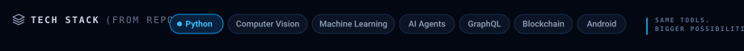
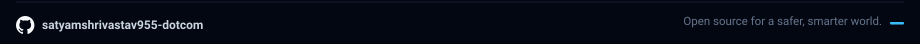

<!-- ═══════════════════ HERO HEADER ═══════════════════ -->

<!-- ═══════════════════ CONNECT BAR ═══════════════════ -->

 

<!-- ═══════════════════ SOCIAL LINKS ═══════════════════ -->

&nbsp;

&nbsp;

&nbsp;

  

<!-- ═══════════════════ NOW BUILDING: CALLSHIELD ═══════════════════ -->

 

 

&nbsp;

&nbsp;

&nbsp;

  

<!-- ═══════════════════ SELECTED WORK HEADER ═══════════════════ -->

 

<!-- ─────────── 1. GraphQL-Sentinel ─────────── -->

 

 

&nbsp;

&nbsp;

  

<!-- ─────────── 2. language-to-action-robot-agent ─────────── -->

 

 

&nbsp;

&nbsp;

  

<!-- ─────────── 3. deepfake-detection-system ─────────── -->

 

 

&nbsp;

&nbsp;

  

<!-- ─────────── 4. face-blockchain-verification ─────────── -->

 

 

&nbsp;

&nbsp;

  

<!-- ─────────── 5. student-performance-prediction-system ─────────── -->

 

 

&nbsp;

&nbsp;

  

<!-- ═══════════════════ TECH STACK ═══════════════════ -->

  

  

<!-- ═══════════════════ FOOTER ═══════════════════ -->

 

&nbsp;

&nbsp;

 

<i>"Better systems for a safer tomorrow."</i> — Satyam Santosh Shrivastav

