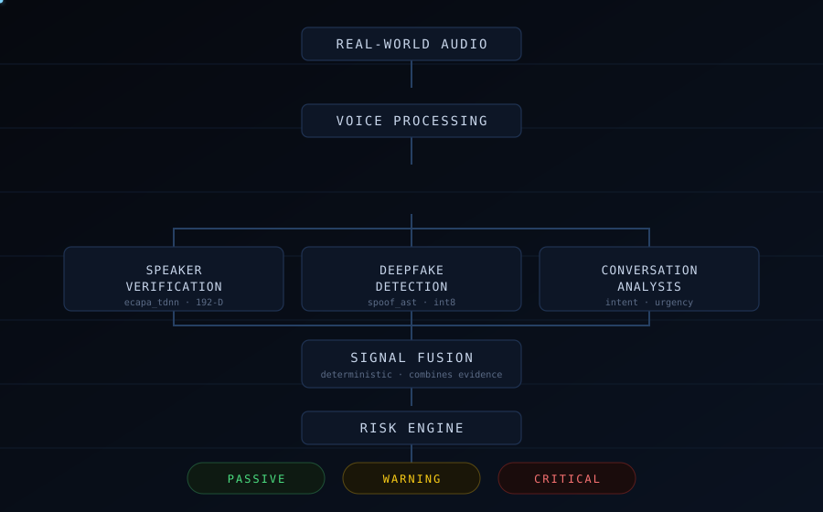

<!-- ================= HERO ================= -->



# Hi, I'm Satyam Santosh Shrivastav

### `BUILDING EDGE AI SYSTEMS FOR VOICE SECURITY, FRAUD DEFENSE & INTELLIGENT AUTOMATION`

`EDGE AI` · `VOICE SECURITY` · `ANDROID` · `INTELLIGENT SYSTEMS`

I build practical AI systems focused on real-world problems — from voice authenticity and fraud defense to intelligent automation and verification systems. My work turns model outputs into decisions that hold up outside the demo.


<!-- ================= NOW BUILDING ================= -->

## 🛡️ Now Building

<table>
<tr>
<td width="62%" valign="top">

### CallShield
**Real-time voice security for safer conversations.**

CallShield combines **speaker verification**, **voice deepfake detection**, **conversational risk analysis**, and **social-engineering detection** to identify impersonation and scam conversations as they happen.

Built for **on-device inference** first — audio is analysed locally, keeping conversations private. Targeting **Android**, **Windows**, and **enterprise integrations**.

`Kotlin` · `ONNX Runtime` · `PyTorch` · `Edge AI` · `Speech`

**→ [github.com/satyamshrivastav955-dotcom/call-shield](https://github.com/satyamshrivastav955-dotcom/call-shield)**

</td>
<td width="38%" valign="top">

```text
 STATUS   ACTIVE DEVELOPMENT
 STAGE    ON-DEVICE VALIDATION
 DEVICE   OPPO CPH2643
 TARGET   API 36 · ANDROID
 MODELS   ecapa_tdnn.int8.onnx
          spoof_ast.int8.onnx
```

</td>
</tr>
</table>

#### On-Device Validation — real hardware, measured results

> Measured on a physical **OPPO CPH2643 (Android API 36)** running quantised `spoof_ast.int8.onnx` and `ecapa_tdnn.int8.onnx`. These are scenario-test results on one device, not production accuracy claims.

<table>
<tr align="center">
<td><h3>5 / 5</h3><sub>DEVICE SCENARIOS PASSED</sub><br><sub>0 failures</sub></td>
<td><h3>~484 ms</h3><sub>MEDIAN SPEAKER VERIFICATION</sub></td>
<td><h3>192-D</h3><sub>SPEAKER EMBEDDING</sub></td>
</tr>
<tr align="center">
<td><h3>1.0</h3><sub>ENROLLED-SPEAKER SIMILARITY</sub></td>
<td><h3>94.8</h3><sub>SCAM + URGENCY RISK</sub></td>
<td><h3>100</h3><sub>CLONE IMPERSONATION RISK</sub></td>
</tr>
</table>

<sub>Reference: normal / passive conversation scores **66.2** risk — the system separates benign talk from coercive patterns rather than flagging everything.</sub>


<!-- ================= ARCHITECTURE ================= -->

## 🧩 System Architecture



**Multi-signal fusion.** Rather than relying on a single detector, CallShield combines multiple signals — voice authenticity, speaker identity, conversational intent, and urgency. AI models generate the evidence; a deterministic fusion engine combines those signals into a continuous risk score and a clear response tier.

```text
REAL-WORLD AUDIO
        ↓
VOICE PROCESSING
        ↓
┌───────────────────────────┐
│ SPEAKER VERIFICATION      │
│ DEEPFAKE DETECTION        │  ← AI models produce evidence
│ CONVERSATION ANALYSIS     │
└─────────────┬─────────────┘
              ↓
       SIGNAL FUSION          ← deterministic logic combines signals
              ↓
        RISK ENGINE
              ↓
 PASSIVE / WARNING / CRITICAL  ← actionable decision
```


<!-- ================= SELECTED WORK ================= -->

## 🚀 Selected Work

<table>
<tr>
<td width="50%" valign="top">

**[CallShield](https://github.com/satyamshrivastav955-dotcom/call-shield)**
Real-time voice security platform combining speaker verification, deepfake detection and conversational risk analysis.
<sub>`VOICE SECURITY` · `EDGE AI` · `ANDROID`</sub>

</td>
<td width="50%" valign="top">

**[GraphQL-Sentinel](https://github.com/satyamshrivastav955-dotcom/GraphQL-Sentinel)**
Security-focused GraphQL analysis and protection tooling that identifies potentially dangerous API behavior.
<sub>`API SECURITY` · `GRAPHQL`</sub>

</td>
</tr>
<tr>
<td width="50%" valign="top">

**[language-to-action-robot-agent](https://github.com/satyamshrivastav955-dotcom/language-to-action-robot-agent)**
Converts natural-language instructions into executable actions for robotic environments.
<sub>`AGENTS` · `ROBOTICS` · `NLP`</sub>

</td>
<td width="50%" valign="top">

**[deepfake-detection-system](https://github.com/satyamshrivastav955-dotcom/deepfake-detection-system)**
Machine-learning pipeline for identifying manipulated or synthetic media.
<sub>`ML` · `SYNTHETIC-MEDIA`</sub>

</td>
</tr>
<tr>
<td width="50%" valign="top">

**[face-blockchain-verification](https://github.com/satyamshrivastav955-dotcom/face-blockchain-verification)**
Biometric verification combining facial identity checks with blockchain-backed records.
<sub>`BIOMETRICS` · `BLOCKCHAIN`</sub>

</td>
<td width="50%" valign="top">

**[student-performance-prediction-system](https://github.com/satyamshrivastav955-dotcom/student-performance-prediction-system)**
ML system for analyzing student data and predicting academic performance.
<sub>`ML` · `DATA`</sub>

</td>
</tr>
<tr>
<td width="50%" valign="top">

**[VoiceShield](https://github.com/satyamshrivastav955-dotcom/Voiceshield)**
Voice-security experimentation focused on speaker identity and voice authenticity.
<sub>`VOICE` · `ANTI-SPOOFING`</sub>

</td>
<td width="50%" valign="top"></td>
</tr>
</table>


<!-- ================= STACK ================= -->

## ⚙️ Engineering Stack

```text
LANGUAGES   Python · Java · Kotlin · JavaScript · SQL
AI / ML     PyTorch · ONNX · Transformers · Speech Processing
SYSTEMS     Android · Edge AI · REST APIs · GraphQL
SECURITY    Voice Authentication · Deepfake Detection · Fraud Detection · Risk Analysis
TOOLS       Git · GitHub · Docker · Linux
```


<!-- ================= HOW I BUILD ================= -->

## 🧠 How I Build

```text
REAL-WORLD INPUT  →  AI / MODELS  →  SIGNAL FUSION  →  RISK / ACTION
```

I'm interested in systems where AI models produce evidence, while deterministic logic turns that evidence into reliable decisions. Models are the sensors; the fusion layer is where engineering makes them trustworthy.


<!-- ================= INTERESTS ================= -->

## 🎯 Current Interests

`Edge AI & on-device inference` · `Voice authentication & anti-spoofing` · `Deepfake & synthetic-media detection` · `AI security` · `Intelligent automation` · `Real-time decision systems` · `Android engineering` · `AI with measurable real-world impact`


<!-- ================= ACTIVITY ================= -->

## 📊 GitHub Activity

<a href="https://github.com/satyamshrivastav955-dotcom">
  
</a>
<a href="https://github.com/satyamshrivastav955-dotcom">
  
</a>

<sub>Live widgets — recent work spans `call-shield`, `student-performance-prediction-system`, `face-blockchain-verification`, `language-to-action-robot-agent`, and `Voiceshield`.</sub>


<!-- ================= CONNECT ================= -->

## 🔗 Connect

[](https://github.com/satyamshrivastav955-dotcom)
[](https://www.linkedin.com/in/satyam-shrivastav-239557392/)

<sub>Email: satyamshrivastav955 [at] gmail [dot] com</sub>

<br>

### `BUILD → TEST → MEASURE → IMPROVE`

**Building technology that is useful beyond the demo.**
