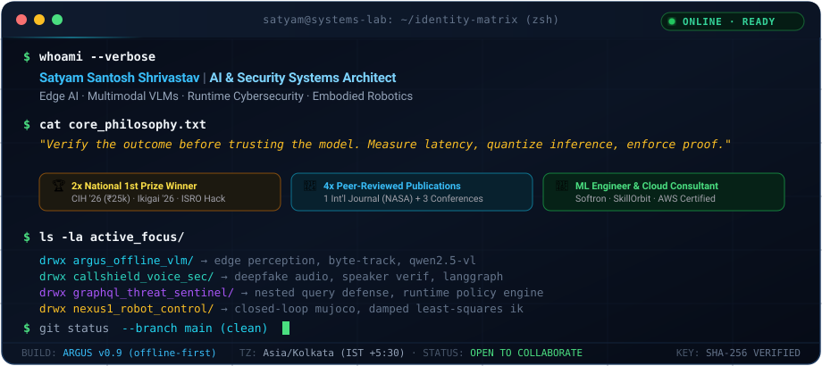
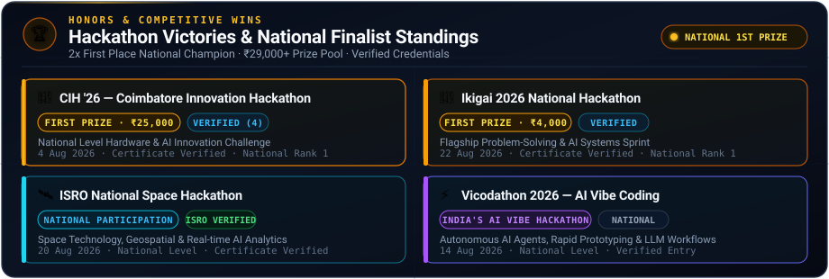
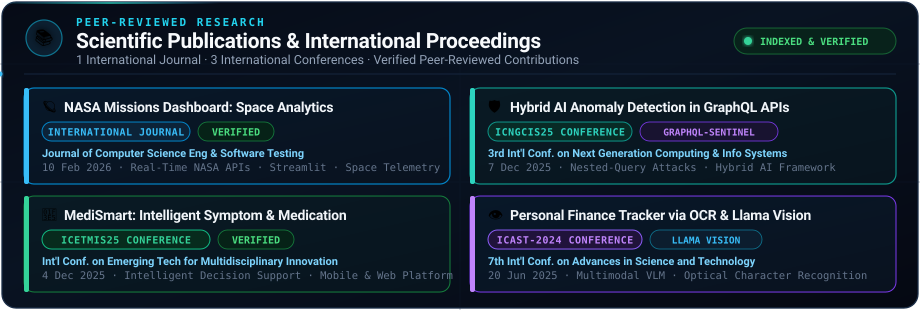
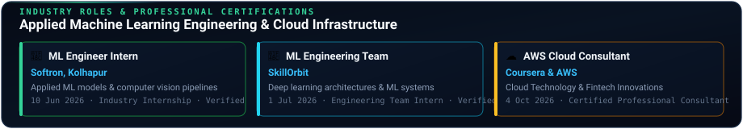

 

  

## 👨‍💻 About Me

I build **AI systems, security architectures, and full-stack products** that connect intelligent reasoning with practical software engineering — spanning computer vision, efficient multimodal inference, cybersecurity, robotics simulation, explainable ML, and workflow automation. Every project tells a technical story: **the problem, the system I designed, the engineering decisions behind it, and the empirical evidence that proves what works.**

  

  
  
  
  
  

### ⚡ Architectural Specialization & Core Pillars

<table>
  <tr>
    <td width="50%" valign="top">
      <h4>👁️ Edge AI &amp; Multimodal Perception</h4>
      <ul>
        <li><b>Offline Video Intelligence:</b> YOLO-family detection, ByteTrack tracking, and pose event triggers running on constrained local hardware (<a href="https://github.com/satyamshrivastav955-dotcom/ai-surveillance">ARGUS</a>).</li>
        <li><b>Efficient VLMs:</b> Quantized Qwen2.5-VL inference with visual token pruning and KV-cache optimization (<a href="https://github.com/satyamshrivastav955-dotcom/argus-vlm-optimization">argus-vlm-optimization</a>).</li>
        <li><b>Multimodal Reasoning:</b> Llama-Vision OCR receipt extraction &amp; document intelligence (<a href="https://drive.google.com/file/d/1A-WLiySdA7d8sr7Dt-2lvzNYS8FxyJZa/view?usp=drivesdk">ICAST Paper</a>).</li>
      </ul>
    </td>
    <td width="50%" valign="top">
      <h4>🛡️ Runtime Security &amp; Threat Defense</h4>
      <ul>
        <li><b>Scam &amp; Impersonation Defense:</b> Synthetic-voice detection, speaker verification, and LangGraph multi-agent risk fusion (<a href="https://github.com/satyamshrivastav955-dotcom/call-shield">CallShield</a>).</li>
        <li><b>GraphQL API Security:</b> AST query complexity inspection and nested DoS prevention (<a href="https://github.com/satyamshrivastav955-dotcom/GraphQL-Sentinel">GraphQL-Sentinel</a>, <a href="https://drive.google.com/file/d/1HHzw4yg203f52CLRhzghn-iNG5n5Hgp1/view?usp=drivesdk">ICNGCIS25 Paper</a>).</li>
        <li><b>Adaptive NIDS:</b> Four-model ensemble (Autoencoder, Isolation Forest, LSTM, Random Forest) on CICIDS2017 (<a href="https://github.com/satyamshrivastav955-dotcom/hybrid-ai-nids">Hybrid AI NIDS</a>).</li>
      </ul>
    </td>
  </tr>
  <tr>
    <td width="50%" valign="top">
      <h4>🤖 Embodied Robotics &amp; Control</h4>
      <ul>
        <li><b>Closed-Loop Action:</b> Local LLM instruction decomposition into manipulation primitives (<a href="https://github.com/satyamshrivastav955-dotcom/language-to-action-robot-agent">NEXUS-1</a>).</li>
        <li><b>Physics Simulation:</b> 6-DOF robotic arm trajectory control in MuJoCo using Damped Least-Squares (DLS) Inverse Kinematics.</li>
        <li><b>Ground-Truth Verification:</b> Measured position error feedback loops ensuring real mechanical execution.</li>
      </ul>
    </td>
    <td width="50%" valign="top">
      <h4>🔗 Verifiable Provenance &amp; Applied ML</h4>
      <ul>
        <li><b>Cryptographic Anchoring:</b> Facial feature extraction (YuNet/SFace), RFC 8785 canonical JSON hashing, and Base Sepolia smart contract anchoring (<a href="https://github.com/satyamshrivastav955-dotcom/face-blockchain-verification">Face Blockchain</a>).</li>
        <li><b>Explainable Decision Support:</b> TreeSHAP feature attributions and DiCE counterfactuals with Fairlearn auditing (<a href="https://github.com/satyamshrivastav955-dotcom/student-performance-prediction-system">Student Intelligence</a>).</li>
        <li><b>Space Analytics:</b> Real-time telemetry &amp; NEO tracking via NASA APIs (<a href="https://drive.google.com/file/d/1UCG-AVRCVX-AOmXhCsDqAuGT0EToVZ4q/view?usp=drivesdk">Published Journal Paper</a>).</li>
      </ul>
    </td>
  </tr>
</table>

> 💡 **Engineering Mindset:** *"Verify the outcome before trusting the model. Measure latency, quantize inference, benchmark on constrained hardware, and deliver verifiable evidence."*

| 🔭 Current Flagship | 🌱 Research Focus | 🏆 Competitive Track Record | 💼 Experience |
|:-------------------:|:-----------------:|:--------------------------:|:-------------:|
| **ARGUS** (Offline Video AI) | Quantized VLM Token Pruning | **2x National 1st Prize** (CIH '26 ₹25k, Ikigai '26) | ML Engineer @ Softron &amp; SkillOrbit |

  

## 🏆 Honors & Hackathon Victories

> National championship titles, cash awards, and competitive AI hackathon standings.

  

<table>
  <tr>
    <td width="50%" valign="top">
      <h3>🥇 CIH '26 — Coimbatore Innovation Hackathon</h3>
      

        
        
        
      

      <b>National Innovation Championship</b> — Awarded 1st Prize out of nationwide engineering teams for innovative hardware &amp; AI architecture. Verified across 4 credential records.
        
      
      &nbsp;<i>4 Aug 2026</i>
    </td>
    <td width="50%" valign="top">
      <h3>🥇 Ikigai 2026 National Hackathon</h3>
      

        
        
        
      

      <b>First Place Winner</b> — Rapid systems prototyping, machine learning model integration, and algorithmic problem-solving under competitive constraints.
        
      
      &nbsp;<i>22 Aug 2026</i>
    </td>
  </tr>
  <tr>
    <td width="50%" valign="top">
      <h3>🛰️ ISRO National Space Hackathon</h3>
      

        
        
        
      

      <b>Space Tech &amp; AI Geospatial Analytics</b> — High-stakes national hackathon organized around space telemetry data, Earth observation analytics, and intelligent systems processing.
        
      
      &nbsp;<i>20 Aug 2026</i>
    </td>
    <td width="50%" valign="top">
      <h3>⚡ Vicodathon 2026 — AI Vibe Coding</h3>
      

        
        
      

      <b>India's Premier AI Vibe Coding Hackathon</b> — Building next-generation autonomous developer workflows, multi-agent pipelines, and rapid AI product prototyping.
        
      
      &nbsp;<i>14 Aug 2026</i>
    </td>
  </tr>
</table>

  <b>Additional National Competitions:</b>
    <a href="https://drive.google.com/file/d/1BuB1R4h0bGT10-hZjUG3HTgmNrQdNmpH/view?usp=drivesdk">ET AI Hackathon (Verified)</a> &bull;
    <a href="https://drive.google.com/file/d/1wnBBS0csNmgErU8fvhxzcZLhb9mfUzfB/view?usp=drivesdk">StudAI Hackathon (Verified)</a> &bull;
    <a href="https://drive.google.com/file/d/1_dsa2roFZOKkklzkFmsisiSkdqACwhjJ/view?usp=drivesdk">InnovaHack 2026 (Verified)</a>
  

  

## 📜 Peer-Reviewed Research Publications

> 1 International Journal &bull; 3 International Conference Publications &bull; Verified Scientific Contributions.

  

<table>
  <tr>
    <td width="50%" valign="top">
      <h3>🪐 NASA Missions Dashboard: Real-Time Space Analytics</h3>
      

        
        
      

      <b>Journal of Computer Science Engineering and Software Testing</b> 
      <i>A Real-Time Space Analytics and Visualization System Using Streamlit and NASA APIs.</i> High-throughput live telemetry, Near-Earth Object trajectory tracking, and interactive space exploration intelligence.
        
      
      &nbsp;<i>10 Feb 2026</i>
    </td>
    <td width="50%" valign="top">
      <h3>🛡️ Real-Time Hybrid AI for GraphQL API Anomaly Detection</h3>
      

        
        
      

      <b>3rd International Conference on Next Generation Computing &amp; Information Systems (ICNGCIS25)</b> 
      <i>Real-Time Hybrid AI Framework for Anomaly Detection in GraphQL APIs under Nested-Query Attacks.</i> Deep query AST decomposition, depth-cost threat modeling, and hybrid anomaly classification (underpins <a href="https://github.com/satyamshrivastav955-dotcom/GraphQL-Sentinel">GraphQL-Sentinel</a>).
        
      
      &nbsp;<i>7 Dec 2025</i>
    </td>
  </tr>
  <tr>
    <td width="50%" valign="top">
      <h3>🏥 MediSmart: Intelligent Symptom &amp; Medication Management</h3>
      

        
        
      

      <b>International Conference on Emerging Technologies for Multidisciplinary Innovation and Sustainability (ICETMIS25)</b> 
      <i>Intelligent Symptom and Medication Management via Mobile and Web Platform.</i> Clinical decision support, cross-interaction contraindication analysis, and reactive health assistance.
        
      
      &nbsp;<i>4 Dec 2025</i>
    </td>
    <td width="50%" valign="top">
      <h3>👁️ Personal Finance Tracker via OCR &amp; Llama Vision</h3>
      

        
        
      

      <b>7th International Conference on Advances in Science and Technology (ICAST-2024)</b> 
      <i>Personal Finance Tracker using Optical Character Recognition with Llama Vision.</i> Multimodal visual token parsing for zero-shot transaction categorization and expense reasoning.
        
      
      &nbsp;<i>20 Jun 2025</i>
    </td>
  </tr>
</table>

  

## 💼 Applied Industry Experience & Credentials

> Real-world engineering internships, model deployments, and certified cloud competencies.

  

| Organization | Role | Focus Areas | Verification |
|:------------|:-----|:------------|:------------:|
| **Softron, Kolhapur** | **ML Engineer Intern** | Production ML pipelines, computer vision inference, model serving | [Certificate ↗](https://drive.google.com/file/d/1hVqqxFKyz78kqeRAUqONeqq7_xRw_KJU/view?usp=drivesdk) |
| **SkillOrbit** | **ML Engineering Team Intern** | Deep learning architectures, model training &amp; systems engineering | [Certificate ↗](https://drive.google.com/file/d/13XaB0prLLaKA5wOFmGm0JNPkOV1Gc7Mb/view?usp=drivesdk) |
| **Coursera &amp; AWS** | **AWS Cloud Technology Consultant** | Cloud infrastructure, microservices, AWS architectural best practices | [Credential ↗](https://drive.google.com/file/d/1tNOxzJV-CIR7rDxigZ8g3LmJj1oA4nD0/view?usp=drivesdk) |
| **Coursera** | **Fintech Innovations Consultant** | Financial technology innovations, algorithmic pipelines &amp; fraud mitigation | [Credential ↗](https://drive.google.com/file/d/1yUuuT_VlAogilsSrhRqEZpdhsgIOkQ4n/view?usp=drivesdk) |
| **SkillOrbit** | **Machine Learning Specialization** | Applied ML algorithms, evaluation metrics &amp; pipeline deployment | [Credential ↗](https://drive.google.com/file/d/17hN_neLrXRqwfIPHAnCHWnbJ1y4DcpXh/view?usp=drivesdk) |

  

## 🚀 Flagship Build — ARGUS · Offline AI Video Intelligence

**See the scene. Understand the event. Deliver the alert.** ARGUS transforms camera feeds into structured observations and event-driven alerts — running inside constrained local hardware instead of depending on the cloud.

- **Perception pipeline** — YOLO-family detection, ByteTrack tracking, pose-based fall/interaction events, plus configurable fire, smoke, and phone-use detectors.
- **Async VLM reasoning** — a quantized Qwen2.5-VL path produces natural-language scene descriptions without blocking the primary video loop.
- **Offline-first alerting** — structured event logging, keyframe capture, and nearby-device alert delivery over a Bitchat/Android link.
- **Companion study** — a separate [argus-vlm-optimization](https://github.com/satyamshrivastav955-dotcom/argus-vlm-optimization) repo benchmarks temporal visual-token pruning and quantized KV-cache trade-offs for long-context video reasoning.

  

## 🛠️ Featured Engineering Work

Eight systems across perception, inference, security decisions, control, provenance, workflows, and explainable prediction.

<table>
  <tr>
    <td width="50%" valign="top">
      
      <b>Multisignal threat analysis</b> — synthetic-voice detection, speaker verification, scam-language classification, and a conditional LangGraph workflow that fuses evidence into an explainable risk summary across Android, web, and desktop clients.
        
      
    </td>
    <td width="50%" valign="top">
      
      <b>Explainable API defense</b> — operation-level query analysis, configurable security policies, risk aggregation, and a React dashboard so a blocked request always communicates <i>which</i> characteristics drove the decision. Backed by <a href="https://drive.google.com/file/d/1HHzw4yg203f52CLRhzghn-iNG5n5Hgp1/view?usp=drivesdk">ICNGCIS25 Paper</a>.
        
      
    </td>
  </tr>
  <tr>
    <td width="50%" valign="top">
      
      <b>Four-model fusion SOC</b> — Random Forest, deep autoencoder, Isolation Forest, and LSTM outputs combined through a decision-level fusion layer, with PSI drift monitoring, alert lifecycle, and a FastAPI + React security operations dashboard on CICIDS2017.
        
      
    </td>
    <td width="50%" valign="top">
      
      <b>Closed-loop embodied AI</b> — a local LLM decomposes instructions into manipulation primitives, a Damped Least-Squares IK controller drives a 6-DOF arm in MuJoCo, and a ground-truth verifier checks the result — retrying from measured position error instead of trusting the plan.
        
      
    </td>
  </tr>
  <tr>
    <td width="50%" valign="top">
      
      <b>Tamper-evident provenance</b> — YuNet detection and SFace features feed reverse-image-search leads through independent similarity checks, then canonicalize the evidence (RFC 8785) into a SHA-256 digest anchored by a Solidity registry on Base Sepolia — embeddings stay off-chain.
        
      
    </td>
    <td width="50%" valign="top">
      
      <b>Brief to delivery in one workspace</b> — client/manager/assignee/reviewer roles, kanban states with submission and revision cycles, deadline conflict detection, and versioned deliverables on React + TypeScript with Firebase auth and an Express API.
        
      
    </td>
  </tr>
  <tr>
    <td width="50%" valign="top">
      
      <b>Explainable decision support</b> — Random Forest prediction with TreeSHAP attribution, DiCE counterfactuals that hold protected attributes fixed, Fairlearn auditing, and a Streamlit + FastAPI interface backed by a model card, data dictionary, and an automated test suite.
        
      
    </td>
    <td width="50%" valign="top" align="center">
       
      <h3>Also building</h3>
      <b>bias-aware-360-review-system</b> — n8n + LLM agent pipeline that turns scattered 360° feedback into evidence-cited reviews with automatic bias detection.  
      <b>retailiq-inventory-system</b> — inventory and store operations management.  
      <b>VoiceShield</b> — voice security and analysis tooling.
        
      
    </td>
  </tr>
</table>

  

## 📌 Live Repository Stats

> Real pin cards with live stars, forks, and language breakdown — no placeholders.

&nbsp;

 

&nbsp;

  

## 📊 GitHub Stats — At a Glance

> ✅ Self-hosted via GitHub Actions — refreshed daily, never hits rate limits.

 

&nbsp;

  

&nbsp;

  

## 📈 Contribution Activity Graph

> ✅ Self-hosted calendar — rendered daily by 

  

## 🐍 Watch My Contributions Get Eaten

  

## 🔬 Detailed Profile Breakdown

 

&nbsp;

 

&nbsp;

  

## 🏆 GitHub Trophies

  

## 🧰 Tech Stack

**⚡ Languages**

**🤖 AI / ML / Computer Vision**

**🔧 Backend & APIs**

**🎨 Frontend & Mobile**

**🗄️ Data & Storage**

**⚙️ DevOps, Cloud & Web3**

  

## 💡 Dev Quote of the Day

  

## 📫 Connect With Me

 

 

⭐️ From [Satyam Shrivastav](https://github.com/satyamshrivastav955-dotcom) — *thanks for stopping by!*

