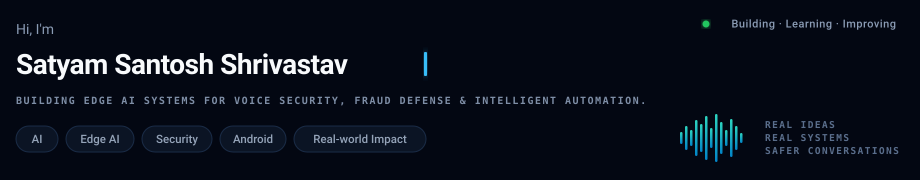

<div align="center">

<strong>AI &amp; Security Systems Builder</strong> · Edge AI · Computer Vision · Cybersecurity · Robotics

<br/>

[](https://leetcode.com/u/Satyam12Leet/)
[](mailto:satyamshrivastav955@gmail.com)

</div>

---

## 👨‍💻 About Me

I build **AI systems, security tools, and full-stack products** that connect intelligent reasoning with practical software engineering — spanning computer vision, efficient multimodal inference, cybersecurity, robotics simulation, explainable ML, and workflow automation. Every project tells a technical story: **the problem, the system I designed, the engineering decisions behind it, and the evidence that shows what works.**

```ts
const satyam: Developer = {
  name: "Satyam Santosh Shrivastav",
  location: "India 🇮🇳",
  role: "AI & Security Systems Builder",
  mission: "Engineering intelligent systems for real-world problems.",

  whatIBuild: [
    "Edge AI video intelligence — detection, tracking, pose events, VLM reasoning (ARGUS)",
    "Multimodal scam & impersonation defense across voice, video, and text (CallShield)",
    "Runtime GraphQL security gateway with explainable policy decisions (GraphQL-Sentinel)",
    "Hybrid intrusion detection with decision-level model fusion + drift monitoring (Hybrid AI NIDS)",
    "Closed-loop language-to-action robot agents in physics simulation (NEXUS-1)",
    "Verifiable image provenance with canonical evidence + blockchain anchoring",
    "Role-aware delivery workspaces and explainable academic ML (TaskOrbit, SPI)",
  ],

  techStack: {
    languages: ["Python", "TypeScript", "Java", "C++", "Kotlin", "Bash"],
    ai_ml:     ["PyTorch", "TensorFlow", "scikit-learn", "OpenCV", "LangGraph"],
    backend:   ["FastAPI", "Flask", "Node.js", "GraphQL", "WebSockets"],
    frontend:  ["React", "Next.js", "Vite", "Tailwind CSS", "Android"],
    data:      ["PostgreSQL", "SQLite", "Redis", "Firebase", "MongoDB"],
    security:  ["Deepfake Detection", "Speaker Verification", "API Threat Modeling", "Blockchain Anchoring"],
    devops:    ["Docker", "Linux", "GitHub Actions", "GCP"],
  },

  currentlyLearning: [
    "Efficient multimodal inference — token pruning & quantized KV cache",
    "Agentic workflows and conditional orchestration with LangGraph",
    "Verifiable computation and tamper-evident evidence design",
  ],

  openTo: [
    "AI/ML & security engineering collaborations",
    "Open-source contributions",
    "Internship / full-time roles in applied AI",
  ],

  contact: {
    linkedin: "satyam-shrivastav-239557392",
    leetcode: "Satyam12Leet",
    email: "satyamshrivastav955@gmail.com",
  },
};
```

| 🔭 Currently Building | 🌱 Currently Learning | 💬 Ask Me About | ⚡ Fun Fact |
|:--------------------:|:--------------------:|:---------------:|:----------:|
| ARGUS — offline video intelligence | Efficient multimodal inference | Computer vision, API security, applied ML | I verify the outcome before I trust the model |

<a href="https://github.com/satyamshrivastav955-dotcom/call-shield">
  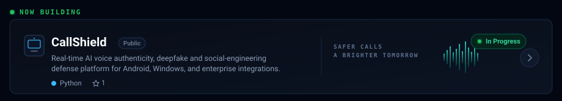
</a>

---

## 🚀 Flagship Build — ARGUS · Offline AI Video Intelligence

<a href="https://github.com/satyamshrivastav955-dotcom/ai-surveillance">
  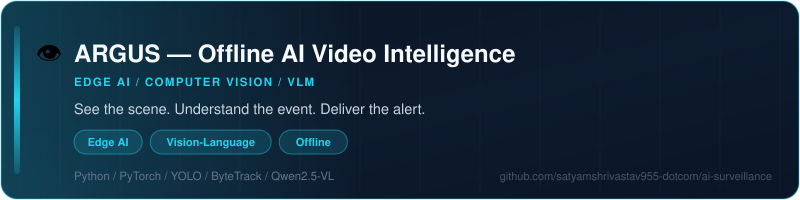
</a>

**See the scene. Understand the event. Deliver the alert.** ARGUS transforms camera feeds into structured observations and event-driven alerts — running inside constrained local hardware instead of depending on the cloud.

- **Perception pipeline** — YOLO-family detection, ByteTrack tracking, pose-based fall/interaction events, plus configurable fire, smoke, and phone-use detectors.
- **Async VLM reasoning** — a quantized Qwen2.5-VL path produces natural-language scene descriptions without blocking the primary video loop.
- **Offline-first alerting** — structured event logging, keyframe capture, and nearby-device alert delivery over a Bitchat/Android link.
- **Companion study** — a separate [argus-vlm-optimization](https://github.com/satyamshrivastav955-dotcom/argus-vlm-optimization) repo benchmarks temporal visual-token pruning and quantized KV-cache trade-offs for long-context video reasoning.

[](https://github.com/satyamshrivastav955-dotcom/ai-surveillance)
[](https://github.com/satyamshrivastav955-dotcom/argus-vlm-optimization)


---

## 🛠️ Featured Engineering Work

Seven systems across perception, inference, security decisions, control, provenance, workflows, and explainable prediction.

<table>
  <tr>
    <td width="50%" valign="top">
      <a href="https://github.com/satyamshrivastav955-dotcom/call-shield">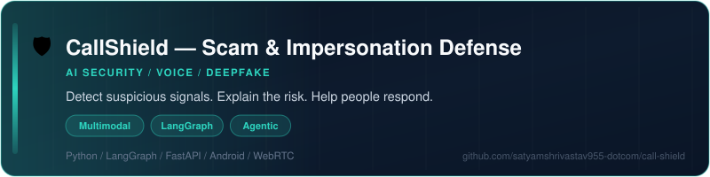</a>
      <sub><b>Multisignal threat analysis</b> — synthetic-voice detection, speaker verification, scam-language classification, and a conditional LangGraph workflow that fuses evidence into an explainable risk summary across Android, web, and desktop clients.</sub>
      <br/><br/>
      <a href="https://github.com/satyamshrivastav955-dotcom/call-shield"></a>
    </td>
    <td width="50%" valign="top">
      <a href="https://github.com/satyamshrivastav955-dotcom/GraphQL-Sentinel">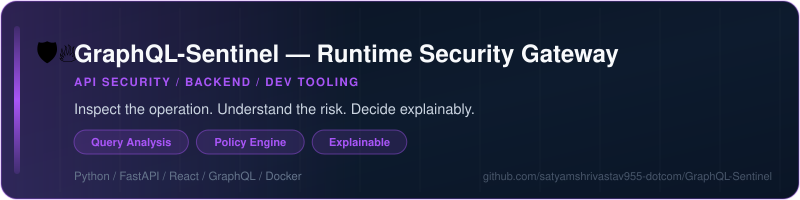</a>
      <sub><b>Explainable API defense</b> — operation-level query analysis, configurable security policies, risk aggregation, and a React dashboard so a blocked request always communicates <i>which</i> characteristics drove the decision.</sub>
      <br/><br/>
      <a href="https://github.com/satyamshrivastav955-dotcom/GraphQL-Sentinel"></a>
    </td>
  </tr>
  <tr>
    <td width="50%" valign="top">
      <a href="https://github.com/satyamshrivastav955-dotcom/hybrid-ai-nids">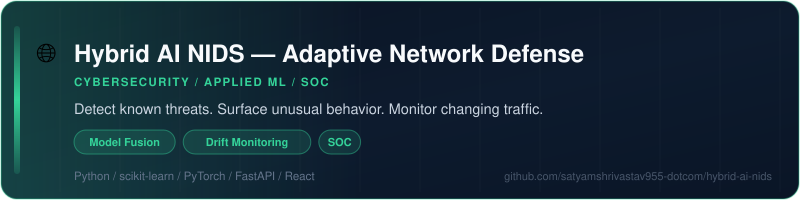</a>
      <sub><b>Four-model fusion SOC</b> — Random Forest, deep autoencoder, Isolation Forest, and LSTM outputs combined through a decision-level fusion layer, with PSI drift monitoring, alert lifecycle, and a FastAPI + React security operations dashboard on CICIDS2017.</sub>
      <br/><br/>
      <a href="https://github.com/satyamshrivastav955-dotcom/hybrid-ai-nids"></a>
    </td>
    <td width="50%" valign="top">
      <a href="https://github.com/satyamshrivastav955-dotcom/language-to-action-robot-agent">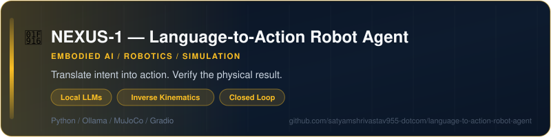</a>
      <sub><b>Closed-loop embodied AI</b> — a local LLM decomposes instructions into manipulation primitives, a Damped Least-Squares IK controller drives a 6-DOF arm in MuJoCo, and a ground-truth verifier checks the result — retrying from measured position error instead of trusting the plan.</sub>
      <br/><br/>
      <a href="https://github.com/satyamshrivastav955-dotcom/language-to-action-robot-agent"></a>
    </td>
  </tr>
  <tr>
    <td width="50%" valign="top">
      <a href="https://github.com/satyamshrivastav955-dotcom/face-blockchain-verification">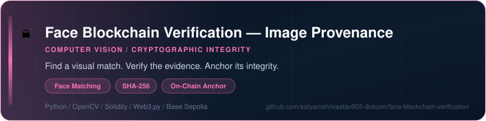</a>
      <sub><b>Tamper-evident provenance</b> — YuNet detection and SFace features feed reverse-image-search leads through independent similarity checks, then canonicalize the evidence (RFC 8785) into a SHA-256 digest anchored by a Solidity registry on Base Sepolia — embeddings stay off-chain.</sub>
      <br/><br/>
      <a href="https://github.com/satyamshrivastav955-dotcom/face-blockchain-verification"></a>
    </td>
    <td width="50%" valign="top">
      <a href="https://github.com/satyamshrivastav955-dotcom/taskorbit">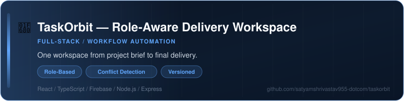</a>
      <sub><b>Brief to delivery in one workspace</b> — client/manager/assignee/reviewer roles, kanban states with submission and revision cycles, deadline conflict detection, and versioned deliverables on React + TypeScript with Firebase auth and an Express API.</sub>
      <br/><br/>
      <a href="https://github.com/satyamshrivastav955-dotcom/taskorbit"></a>
    </td>
  </tr>
  <tr>
    <td width="50%" valign="top">
      <a href="https://github.com/satyamshrivastav955-dotcom/student-performance-prediction-system">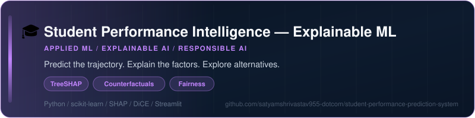</a>
      <sub><b>Explainable decision support</b> — Random Forest prediction with TreeSHAP attribution, DiCE counterfactuals that hold protected attributes fixed, Fairlearn auditing, and a Streamlit + FastAPI interface backed by a model card, data dictionary, and an automated test suite.</sub>
      <br/><br/>
      <a href="https://github.com/satyamshrivastav955-dotcom/student-performance-prediction-system"></a>
    </td>
    <td width="50%" valign="top" align="center">
      <br/>
      <h3>Also building</h3>
      <sub><b>bias-aware-360-review-system</b> — n8n + LLM agent pipeline that turns scattered 360° feedback into evidence-cited reviews with automatic bias detection.<br/><br/>
      <b>retailiq-inventory-system</b> — inventory and store operations management.<br/><br/>
      <b>VoiceShield</b> — voice security and analysis tooling.</sub>
      <br/><br/>
      <a href="https://github.com/satyamshrivastav955-dotcom?tab=repositories"></a>
    </td>
  </tr>
</table>

---

## 🧪 Proof of Work

The interesting part of an AI system is the engineering constraint it survives. These are the design choices I use to turn model output into a dependable product.

| System | Architecture / models | Runtime signal | Engineering constraint |
|:---|:---|:---|:---|
| [ARGUS](https://github.com/satyamshrivastav955-dotcom/ai-surveillance) | YOLO-family detection + ByteTrack + Qwen2.5-VL | Real-time structured video events | Offline-first perception and alerting |
| [CallShield](https://github.com/satyamshrivastav955-dotcom/call-shield) | Speaker verification + spoof detection + LangGraph | Evidence-fused call risk | Explainable decisions across multiple signals |
| [NEXUS-1](https://github.com/satyamshrivastav955-dotcom/language-to-action-robot-agent) | Local LLM + Damped Least-Squares IK + MuJoCo | Closed-loop manipulation | Retry from measured error, not plan text |
| [GraphQL-Sentinel](https://github.com/satyamshrivastav955-dotcom/GraphQL-Sentinel) | AST query analysis + policy engine | Operation-level gateway decision | Every block carries an explainable reason |

<details>
  <summary><b>Open the CallShield architecture deep dive</b> — audio to explainable risk</summary>
  <br/>
  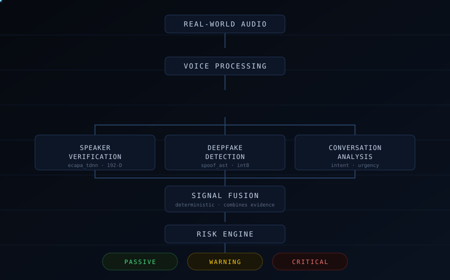
</details>

---

## 📊 GitHub Stats — At a Glance

> ✅ Served from the repository — refreshed daily by GitHub Actions, so page views do not depend on a live card service.

<div align="center">

[](https://github.com/satyamshrivastav955-dotcom/satyamshrivastav955-dotcom/actions/workflows/grs.yml)

<br/>


&nbsp;


</div>

---

## 📈 Contribution Activity Graph

> ✅ Self-hosted calendar — rendered daily by [](https://github.com/satyamshrivastav955-dotcom/satyamshrivastav955-dotcom/actions/workflows/activity-graph.yml)

<div align="center">

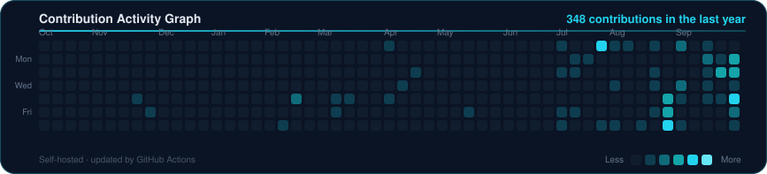

</div>

---

## 🐍 Watch My Contributions Get Eaten

<div align="center">


</div>

---

## 🧰 Tech Stack

<div align="center">

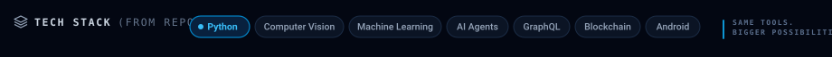

</div>

---

## 💡 Dev Quote of the Day

<div align="center">

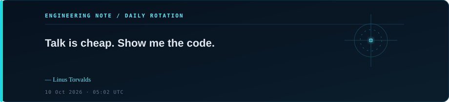

<sub>Curated locally and refreshed daily by <a href="./profile/QUOTE.md">the profile workflow</a>.</sub>

</div>

---

## 📫 Connect With Me

<div align="center">

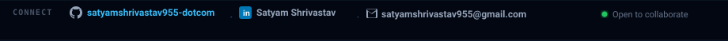

[](https://www.linkedin.com/in/satyam-shrivastav-239557392/)
[](https://github.com/satyamshrivastav955-dotcom)
[](https://leetcode.com/u/Satyam12Leet/)
[](mailto:satyamshrivastav955@gmail.com)

<br/>


<br/>

⭐️ From [Satyam Shrivastav](https://github.com/satyamshrivastav955-dotcom) — *thanks for stopping by!*

</div>

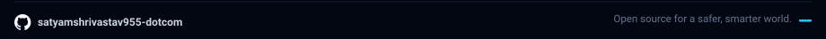
