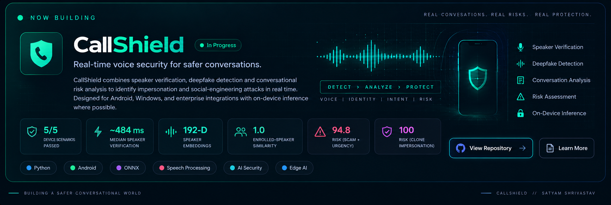
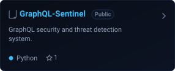
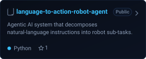
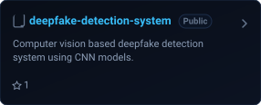
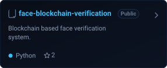
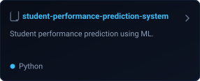
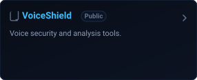

 

  <strong>AI &amp; Security Systems Builder</strong> 
  Building practical intelligence for safer, smarter systems.

&nbsp;

&nbsp;

 

<table align="center">
  <tr>
    <td align="center" width="33%"><strong>FOCUS</strong> Edge AI · Trust · Automation</td>
    <td align="center" width="33%"><strong>BUILDING</strong> Voice security with CallShield</td>
    <td align="center" width="33%"><strong>APPROACH</strong> Useful systems over hype</td>
  </tr>
</table>

 

## About

I build applied AI systems that connect models to real-world signals, decisions, and outcomes. My work sits at the intersection of **machine learning, security, computer vision, voice intelligence, and intelligent automation**.

- Designing detection and verification systems for high-risk digital interactions
- Exploring edge inference, multimodal signals, and agentic workflows
- Turning research ideas into practical prototypes with clear user value
- Learning in public and open to thoughtful collaboration

 

## Now building · CallShield

  

<table>
  <tr>
    <td width="58%" valign="top">
      <h3>Real-time voice security for safer conversations</h3>
      
CallShield explores how speaker verification, deepfake detection, and conversational risk analysis can work together to identify suspicious calls without getting in the way of normal conversations.

      

        
        
        
      

    </td>
    <td width="42%" valign="top">
      <strong>Core signals</strong> 
      Speaker verification Deepfake detection Conversation analysis Evidence fusion Risk-aware outputs
        
      <strong>Status</strong> 
      Active development · prototype to system
    </td>
  </tr>
</table>

  
<strong>View the CallShield system map</strong>

   
  

    
  

 

## Selected work

Small systems, practical experiments, and security-focused prototypes.

<table>
  <tr>
    <td width="50%" valign="top">
      
    </td>
    <td width="50%" valign="top">
      
    </td>
  </tr>
  <tr>
    <td width="50%" valign="top">
      
    </td>
    <td width="50%" valign="top">
      
    </td>
  </tr>
  <tr>
    <td width="50%" valign="top">
      
    </td>
    <td width="50%" valign="top">
      
    </td>
  </tr>
</table>

  <a href="https://github.com/satyamshrivastav955-dotcom?tab=repositories"><strong>Explore all repositories →</strong></a>

 

## Toolkit

  

  
  
  
  
  
  

 

## GitHub signal

  
  &nbsp;
  

The live contribution graph below this README is the source of truth for activity.

 

  
   
  <i>“Build useful systems. Keep learning. Leave things safer than you found them.”</i>

